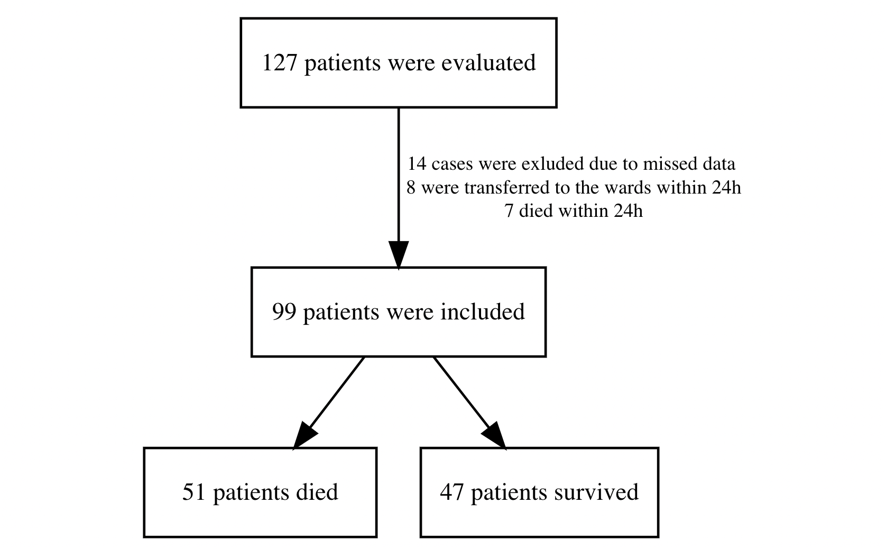
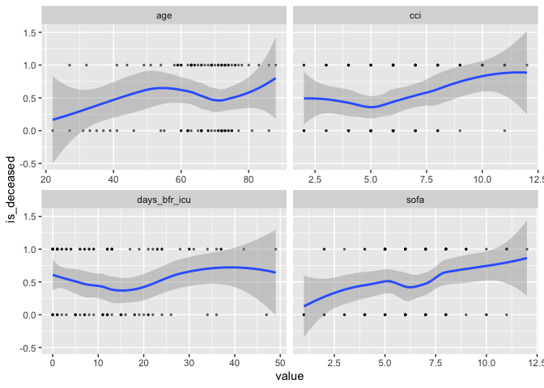
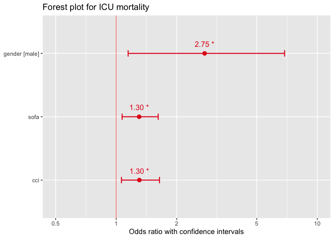
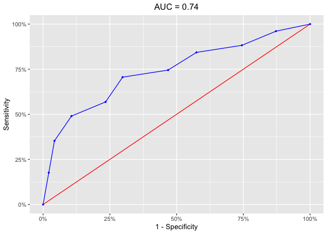

Condition-related mortality predictors in patients with hematological
malignancies, admitted to intensive care unit: a single-center
observational study
================
Sergei Vladimirov
2023-12-27

## Abstract

*Purpose:* Previous research showed conflicting results about mortality
predictors in critically ill patients with hematological malignancies
(HM). The primary aim of this study was to determine mortality in
critically ill patients with HM in intensive care unit (ICU) and to
reveal risk factors predicting the outcome.

*Methods and materials:* All patients with HM admitted to ICU at our
hospital during 1 year were enrolled. Clinical data upon ICU admission
was collected and then outcomes were estimated.

*Results:* ICU mortality was 52% among 98 HM patients. According to
multivariate analysis, male sex (OR 2.75, CI: 1.15–6.88, p = 0.026),
high SOFA score (OR 1.30, CI: 1.07–1.62, p = 0.012) and high Charlson
Comorbidity Index (OR 1.30, CI: 1.06–1.64, p = 0.016) were associated
with the outcome.

*Conclusion:* We found three independent predictors for ICU mortality.
Further research is needed to validate current findings and reveal new
mortality predictors in critically ill HM patients.

## Introduction

Patients with hematologic malignancies (HMs) have an increased risk of
death compared to other oncology patients in settings of intensive care
unit (ICU). According to previous research1, the predictive value of
different admission factors is constantly changing, and several studies
on this topic have conflicting results. Our research question is
addressed to identifying factors in the condition of hematological
patients that can predict a poor ICU outcome. The primary aim of this
study was to determine ICU mortality and risk factors predicting the
outcome of critically ill patients with HMs. We hypothesized that there
are some significant factors in the condition of HM patients at the
moment of ICU admission that are associated with mortality.

## Methods

Our research is an observational, single-center study. We
retrospectively evaluated baseline characteristics of adult HM patients
non-electively admitted to the medical ICU of our hospital from July 1,
2022 to June 30,2023. All the HM diagnoses were based on the
pathological examination results or medical records. All data were
obtained from a local ICU electronic database. Cases with a critical
amount of missing data, as well as those who died or transferred to the
floor within 24 hours were excluded from the study.

**Figure 1. Flowchart of the study**


Upon ICU admission, we included baseline patients’ information on
demographic data, diagnosis, extent of organ dysfunction, comorbidity
burden, presence of neutropenia, disease status and number of days in
hospital prior to ICU referral. Based on above-mentioned information,
independent variables were created, and the outcome of ICU
hospitalization was set as a dependent variable (Table 1).

``` r
#Importing and optimizing an original dataset
original_data <- read_csv('final_project_df.csv')


original_data <- original_data %>%
  mutate_if(is.character, as.factor) %>%  # convert independent character variables to factors
  mutate(neutropenia = as.factor(neutropenia)) %>%  # convert binary independent variable to factor
  select(id, gender, age, cci, diagnosis,
         disease_status, days_bfr_icu, 
         sofa, neutropenia, is_deceased)
```

**Table 1. Characteristics of variables**
<table>
<thead>
<tr>
<th style="text-align:left;">
variable
</th>
<th style="text-align:left;">
definition
</th>
<th style="text-align:left;">
type
</th>
<th style="text-align:left;">
status
</th>
</tr>
</thead>
<tbody>
<tr>
<td style="text-align:left;">
id
</td>
<td style="text-align:left;">
anonymized identical number of patient
</td>
<td style="text-align:left;">
numerical
</td>
<td style="text-align:left;">
independent
</td>
</tr>
<tr>
<td style="text-align:left;">
gender
</td>
<td style="text-align:left;">
gender of patient
</td>
<td style="text-align:left;">
categorical, binary
</td>
<td style="text-align:left;">
independent
</td>
</tr>
<tr>
<td style="text-align:left;">
age
</td>
<td style="text-align:left;">
age of patient
</td>
<td style="text-align:left;">
numerical, years
</td>
<td style="text-align:left;">
independent
</td>
</tr>
<tr>
<td style="text-align:left;">
cci
</td>
<td style="text-align:left;">
Charlson Comorbidity Index - most widely used scoring system for
comorbidities
</td>
<td style="text-align:left;">
numerical, points
</td>
<td style="text-align:left;">
independent
</td>
</tr>
<tr>
<td style="text-align:left;">
diagnosis
</td>
<td style="text-align:left;">
type of hematological malignancy
</td>
<td style="text-align:left;">
categorical
</td>
<td style="text-align:left;">
independent
</td>
</tr>
<tr>
<td style="text-align:left;">
disease_status
</td>
<td style="text-align:left;">
status of HM progression
</td>
<td style="text-align:left;">
categorical: p (progression) - relapsed or refractory disease, n - newly
diagnosed
</td>
<td style="text-align:left;">
independent
</td>
</tr>
<tr>
<td style="text-align:left;">
days_bfr_icu
</td>
<td style="text-align:left;">
number of days in hospital before admission to ICU
</td>
<td style="text-align:left;">
numerical, days
</td>
<td style="text-align:left;">
independent
</td>
</tr>
<tr>
<td style="text-align:left;">
sofa
</td>
<td style="text-align:left;">
sequential organ failure assessment score (SOFA score), is used to
determine the extent of organ function or rate of failure
</td>
<td style="text-align:left;">
numerical, points
</td>
<td style="text-align:left;">
independent
</td>
</tr>
<tr>
<td style="text-align:left;">
neutropenia
</td>
<td style="text-align:left;">
absolute neutrophil count \< 1000 per mm3
</td>
<td style="text-align:left;">
categorical, binary (1 = yes, 0 = no)
</td>
<td style="text-align:left;">
independent
</td>
</tr>
<tr>
<td style="text-align:left;">
is_deceased
</td>
<td style="text-align:left;">
outcome (1 is death, 0 is survival)
</td>
<td style="text-align:left;">
categorical, binary (1 is death, 0 is survival)
</td>
<td style="text-align:left;">
dependent
</td>
</tr>
</tbody>
</table>

This study was carried out according to the principles of the
Declaration of Helsinki. Approval was granted by the local ethics
committee (date: 03.08.2023 / no: 1236). Since we performed a
retrospective analysis of routinely collected de-identified data,
informed consents from the patients were not required. The trial was
registered. All statistical analyses were performed using R version
4.2.1 (R Core Team, 2022). Сontinuous variables were described as mean
(standard deviation), median (25–75 percentiles) and range. We performed
a univariate analysis first to calculate the odds ratio (OR) of
mortality, and statistically significant factors were then used in a
multivariate logistic regression model to determine outcome prediction.
Receiver operating curve (ROC) was done for the final model. In this
research, all the tests were two-sided, and p \< 0.05 was considered as
statistically significant.

## Results

The baseline demographic and clinical characteristics of all 98 patients
are given in Table 2. The patients’ mean (SD) age was 64 (14) years, and
just over half (55%) were females. Acute leukemia was the most frequent
diagnosis (43%), followed by multiple myeloma (26%), then non-Hodgkin’s
lymphoma (18%). 48 (49%) of patients had refractory or relapsed disease
status. 35 (36%) patients had neutropenia on admission. Median (IQR)
time in the ward before admission to ICU was 11 (3, 20) days. Mean (SD)
SOFA score on ICU referral was 6.38 (2.37) points, and Charlson
Comorbidity Index was 6.1 (2.25) points.

``` r
# I have experienced some problems with rendering this summary table in github output format, so I have uploaded png with the result

original_data %>% 
  select(gender, age, cci, diagnosis,
         disease_status, days_bfr_icu, 
         sofa, neutropenia, is_deceased) %>% 
  tbl_summary(     
    by = is_deceased,     # stratify entire table by outcome
    type = all_continuous() ~ "continuous2",
    statistic = list(all_continuous() ~ c(
      "{mean} ({sd})",                             # line 1: mean and SD
      "{median} ({p25}, {p75})",                   # line 2: median and IQR
      "{min}, {max}"))) %>% 
      
  bold_labels() %>%
  modify_header(
    list(
      stat_1 ~ "**Survived**  \n N = {n}",
      stat_2 ~ "**Dead**  \n N = {n}")) %>%
  modify_footnote(update = everything() ~ NA) %>%
  add_overall() -> desc_table


```

**Table 2. Baseline characteristics of patients**


The ICU mortality was 52%. We used logistic regression in order to
reveal factors associated with primary outcome of the study. All
continuous variables were checked for linearity beforehand (Figure 2).

``` r
# code for linearuty checking

original_data %>% 
  select(is_deceased, age, cci, sofa, days_bfr_icu) %>% 
  pivot_longer(all_of(c("age", "sofa", "sofa", "cci",
                        "days_bfr_icu")), names_to = "predictors") %>% 
  ggplot(aes(x = value, y = is_deceased)) + 
  geom_point(size = 0.5, alpha = 0.5) +
  geom_smooth(method = "loess") + 
  facet_wrap(~predictors, scales = "free_x")
#  +
#  labs ( title = "Fig.2  Checking numeric variables for linearity",
 #        subtitle = "All of the slopes are monotonic, i.e. linear")
```

**Figure 2. Checking numeric variables for linearity.**

*All of the slopes are monotonic, i.e. linear*



Then we performed univariate analysis to calculate the odds ratio of
mortality for each of collected covariates (Table 3).

``` r
uni_object <-  glm(is_deceased ~ gender + age + sofa + cci +
                       disease_status + days_bfr_icu, data = original_data, family = "binomial")


sjPlot:: tab_model(uni_object, 
                    show.intercept = FALSE,
                    show.aic = TRUE,
                    show.r2 = FALSE,
                    title = 'Results of univariate analysis of factors') 
```

**Table 3. Results of univariate analysis of factors.**

*Three statistically significant factors were identified in univariate
model: male sex, higher SOFA and higher CCI scores.*

<table style="border-collapse:collapse; border:none;">
<tr>
<th style="border-top: double; text-align:center; font-style:normal; font-weight:bold; padding:0.2cm;  text-align:left; ">
 
</th>
<th colspan="3" style="border-top: double; text-align:center; font-style:normal; font-weight:bold; padding:0.2cm; ">
is deceased
</th>
</tr>
<tr>
<td style=" text-align:center; border-bottom:1px solid; font-style:italic; font-weight:normal;  text-align:left; ">
Predictors
</td>
<td style=" text-align:center; border-bottom:1px solid; font-style:italic; font-weight:normal;  ">
Odds Ratios
</td>
<td style=" text-align:center; border-bottom:1px solid; font-style:italic; font-weight:normal;  ">
CI
</td>
<td style=" text-align:center; border-bottom:1px solid; font-style:italic; font-weight:normal;  ">
p
</td>
</tr>
<tr>
<td style=" padding:0.2cm; text-align:left; vertical-align:top; text-align:left; ">
gender \[male\]
</td>
<td style=" padding:0.2cm; text-align:left; vertical-align:top; text-align:center;  ">
2.73
</td>
<td style=" padding:0.2cm; text-align:left; vertical-align:top; text-align:center;  ">
1.12 – 6.95
</td>
<td style=" padding:0.2cm; text-align:left; vertical-align:top; text-align:center;  ">
<strong>0.030</strong>
</td>
</tr>
<tr>
<td style=" padding:0.2cm; text-align:left; vertical-align:top; text-align:left; ">
age
</td>
<td style=" padding:0.2cm; text-align:left; vertical-align:top; text-align:center;  ">
0.99
</td>
<td style=" padding:0.2cm; text-align:left; vertical-align:top; text-align:center;  ">
0.95 – 1.03
</td>
<td style=" padding:0.2cm; text-align:left; vertical-align:top; text-align:center;  ">
0.508
</td>
</tr>
<tr>
<td style=" padding:0.2cm; text-align:left; vertical-align:top; text-align:left; ">
sofa
</td>
<td style=" padding:0.2cm; text-align:left; vertical-align:top; text-align:center;  ">
1.31
</td>
<td style=" padding:0.2cm; text-align:left; vertical-align:top; text-align:center;  ">
1.07 – 1.63
</td>
<td style=" padding:0.2cm; text-align:left; vertical-align:top; text-align:center;  ">
<strong>0.012</strong>
</td>
</tr>
<tr>
<td style=" padding:0.2cm; text-align:left; vertical-align:top; text-align:left; ">
cci
</td>
<td style=" padding:0.2cm; text-align:left; vertical-align:top; text-align:center;  ">
1.40
</td>
<td style=" padding:0.2cm; text-align:left; vertical-align:top; text-align:center;  ">
1.07 – 1.90
</td>
<td style=" padding:0.2cm; text-align:left; vertical-align:top; text-align:center;  ">
<strong>0.020</strong>
</td>
</tr>
<tr>
<td style=" padding:0.2cm; text-align:left; vertical-align:top; text-align:left; ">
disease status \[p\]
</td>
<td style=" padding:0.2cm; text-align:left; vertical-align:top; text-align:center;  ">
1.27
</td>
<td style=" padding:0.2cm; text-align:left; vertical-align:top; text-align:center;  ">
0.50 – 3.35
</td>
<td style=" padding:0.2cm; text-align:left; vertical-align:top; text-align:center;  ">
0.617
</td>
</tr>
<tr>
<td style=" padding:0.2cm; text-align:left; vertical-align:top; text-align:left; ">
days bfr icu
</td>
<td style=" padding:0.2cm; text-align:left; vertical-align:top; text-align:center;  ">
1.00
</td>
<td style=" padding:0.2cm; text-align:left; vertical-align:top; text-align:center;  ">
0.96 – 1.04
</td>
<td style=" padding:0.2cm; text-align:left; vertical-align:top; text-align:center;  ">
0.935
</td>
</tr>
<tr>
<td style=" padding:0.2cm; text-align:left; vertical-align:top; text-align:left; padding-top:0.1cm; padding-bottom:0.1cm; border-top:1px solid;">
Observations
</td>
<td style=" padding:0.2cm; text-align:left; vertical-align:top; padding-top:0.1cm; padding-bottom:0.1cm; text-align:left; border-top:1px solid;" colspan="3">
98
</td>
</tr>
<tr>
<td style=" padding:0.2cm; text-align:left; vertical-align:top; text-align:left; padding-top:0.1cm; padding-bottom:0.1cm;">
AIC
</td>
<td style=" padding:0.2cm; text-align:left; vertical-align:top; padding-top:0.1cm; padding-bottom:0.1cm; text-align:left;" colspan="3">
130.026
</td>
</tr>
</table>

Statistically significant variables were checked for multicollinearity
(Table 4).

For checking for the presence of multicollinearity, we calculated the
generalised variance inflation factor (GVIF) for each of the parameters
in the final model.

A commonly accepted rule is that GVIF should not be greater than 5-10
for any variable, otherwise multicollinearity may exist (6).

``` r
dependent <- "is_deceased"
explanatory <- c("gender","cci", "sofa")
original_data %>% 
  glmmulti(dependent, explanatory) %>%
  car::vif() %>%   # selecting GVIF
  as.data.frame() %>%
  add_column(c("gender", "cci", "sofa")) %>% 
  rename(variable = 'c("gender", "cci", "sofa")', GVIF = ".") %>% 
  select(variable, everything()) %>% kable()
```

**Table 4. Checking for multicollinearity using GVIF.**

*Values for all of the variables are less then 5, so multicollinearity
is absent.*

<table>
<thead>
<tr>
<th style="text-align:left;">
</th>
<th style="text-align:left;">
variable
</th>
<th style="text-align:right;">
GVIF
</th>
</tr>
</thead>
<tbody>
<tr>
<td style="text-align:left;">
gender
</td>
<td style="text-align:left;">
gender
</td>
<td style="text-align:right;">
1.007099
</td>
</tr>
<tr>
<td style="text-align:left;">
cci
</td>
<td style="text-align:left;">
cci
</td>
<td style="text-align:right;">
1.035426
</td>
</tr>
<tr>
<td style="text-align:left;">
sofa
</td>
<td style="text-align:left;">
sofa
</td>
<td style="text-align:right;">
1.034088
</td>
</tr>
</tbody>
</table>

All three varibles were included into a multivariate regression analysis
(Table 5).

``` r
object <- glm(is_deceased ~ gender + sofa + cci, data = original_data, family = "binomial")

sjPlot:: tab_model(object, 
                    show.intercept = FALSE,
                    show.aic = TRUE,
                    show.r2 = FALSE)
#,title = 'Results of multivariate analysis of factors') 
```

**Table 5. Results of multivariate analysis of factors.**

<table style="border-collapse:collapse; border:none;">
<tr>
<th style="border-top: double; text-align:center; font-style:normal; font-weight:bold; padding:0.2cm;  text-align:left; ">
 
</th>
<th colspan="3" style="border-top: double; text-align:center; font-style:normal; font-weight:bold; padding:0.2cm; ">
is deceased
</th>
</tr>
<tr>
<td style=" text-align:center; border-bottom:1px solid; font-style:italic; font-weight:normal;  text-align:left; ">
Predictors
</td>
<td style=" text-align:center; border-bottom:1px solid; font-style:italic; font-weight:normal;  ">
Odds Ratios
</td>
<td style=" text-align:center; border-bottom:1px solid; font-style:italic; font-weight:normal;  ">
CI
</td>
<td style=" text-align:center; border-bottom:1px solid; font-style:italic; font-weight:normal;  ">
p
</td>
</tr>
<tr>
<td style=" padding:0.2cm; text-align:left; vertical-align:top; text-align:left; ">
gender \[male\]
</td>
<td style=" padding:0.2cm; text-align:left; vertical-align:top; text-align:center;  ">
2.75
</td>
<td style=" padding:0.2cm; text-align:left; vertical-align:top; text-align:center;  ">
1.15 – 6.88
</td>
<td style=" padding:0.2cm; text-align:left; vertical-align:top; text-align:center;  ">
<strong>0.026</strong>
</td>
</tr>
<tr>
<td style=" padding:0.2cm; text-align:left; vertical-align:top; text-align:left; ">
sofa
</td>
<td style=" padding:0.2cm; text-align:left; vertical-align:top; text-align:center;  ">
1.30
</td>
<td style=" padding:0.2cm; text-align:left; vertical-align:top; text-align:center;  ">
1.07 – 1.62
</td>
<td style=" padding:0.2cm; text-align:left; vertical-align:top; text-align:center;  ">
<strong>0.012</strong>
</td>
</tr>
<tr>
<td style=" padding:0.2cm; text-align:left; vertical-align:top; text-align:left; ">
cci
</td>
<td style=" padding:0.2cm; text-align:left; vertical-align:top; text-align:center;  ">
1.30
</td>
<td style=" padding:0.2cm; text-align:left; vertical-align:top; text-align:center;  ">
1.06 – 1.64
</td>
<td style=" padding:0.2cm; text-align:left; vertical-align:top; text-align:center;  ">
<strong>0.016</strong>
</td>
</tr>
<tr>
<td style=" padding:0.2cm; text-align:left; vertical-align:top; text-align:left; padding-top:0.1cm; padding-bottom:0.1cm; border-top:1px solid;">
Observations
</td>
<td style=" padding:0.2cm; text-align:left; vertical-align:top; padding-top:0.1cm; padding-bottom:0.1cm; text-align:left; border-top:1px solid;" colspan="3">
98
</td>
</tr>
<tr>
<td style=" padding:0.2cm; text-align:left; vertical-align:top; text-align:left; padding-top:0.1cm; padding-bottom:0.1cm;">
AIC
</td>
<td style=" padding:0.2cm; text-align:left; vertical-align:top; padding-top:0.1cm; padding-bottom:0.1cm; text-align:left;" colspan="3">
124.710
</td>
</tr>
</table>

All of included factors - male sex (OR 2.75, CI: 1.15–6.88, p = 0.026),
high SOFA score (OR 1.30, CI: 1.07–1.62, p = 0.012) and high Charlson
Comorbidity Index (OR 1.30, CI: 1.06–1.64, p = 0.016) were associated
with poor outcome.

``` r
sjPlot:: plot_model(type = "est", object, show.values = TRUE, width = 0.1,
                   axis.labels = "" , 
                   title = 'Odds ratio of ICU mortality, multivariate model',
                   axis.lim = c(0.99,10),
                   vline.color = 'red') +
  ylab("Odds ratio with confidence intervals")
```

**Figure 3. Odds ratio of ICU mortality, multivariate model**

<!-- -->

Overall performance of multivariate model characterized by Akaike
information criterion (AIC)124.71 and area under the curve (AUC) 0.74
(Figure 3).

``` r
blorr::blr_roc_curve(blr_gains_table(object), title = "AUC = 0.74" ) 
```

**Figure 4. ROC curve for the model.**

<!-- -->

## Discussion

To our knowledge, this is the first observational study in Russia to
report the prognostic value of condition and comorbidity factors related
to ICU mortality in HM population.

We retrospectively evaluated admission data of 98 critically ill
patients for prognostic factors for ICU outcome during a 1-year period.
The ICU mortality rate in our sample was high (52%). Male sex, high SOFA
and CCI scores were associated with ICU mortality both in univariate and
multivariate analysis.

Mortality in our study corresponds to the average ICU mortality in
previous studies. According to preceding research, ICU mortality in
patients with HMs varied between 26 and 84.1%2. This wide range can be
explained by differences in admission and discharge policy, severity of
condition in study populations, geographic and socioeconomic factors3.
We reassessed the prognostic significance of previously published
factors for critically ill patients with HMs.

Our findings come in line with prior research in that the severity of
organ failure and extent of comorbidity are associated with poor ICU
outcomes4,5. We did not reveal statistical significance of neutropenia
and advanced disease status as prognostic factors, and it corroborates
previous studies that defined these factors as controversial.

Our multivariate model revealed male sex as a significant prognostic
factor for ICU mortality. At this point, we do not have a firm
explanation of this result from neither background nor foreground
knowledge, so this finding has to be validated. This study has several
limitations.

First, due to the retrospective nature of our study some data may have
been missed. Second, as this is a single-center study, our findings can
hardly be generalized to the entire population.

Third, due to the relatively small sample size we were unable to
internally validate the outcome prediction model.

Fourth, our study did not estimate disease-specific factors, except for
presence of progression or relapse.

Finally, due to variations in severity of cases, ICU admission and
discharge policies, end-of-life-care protocols, we can not directly
compare mortality rates to other studies.

## Conclusion

Our results demonstrated that critically ill patients with hematological
malignancies have a high mortality. We have found that severity of organ
failure assessed by SOFA score, high comorbidity and male gender may
have an impact on ICU mortality. Prospective multicentre studies may
help to explore validity of these results. Other factors related to
natural history and specific therapy for underlying malignancy need to
be evaluated regarding their association to ICU outcomes.

## References

1.  Cheng Q, Tang Y, Yang Q, Wang E, Liu J, Li X. The prognostic factors
    for patients with hematological malignancies admitted to the
    intensive care unit. SpringerPlus. 2016;5(1):2038.
    <doi:10.1186/s40064-016-3714-z>
2.  Chen CL, Wang ST, Cheng WC, Wu BR, Liao WC, Hsu WH. Outcomes and
    Prognostic Factors in Critical Patients with Hematologic
    Malignancies. J Clin Med. 2023;12(3):958. <doi:10.3390/jcm12030958>
3.  Kalicińska E, Kuszczak B, Dębski J, et al. Hematological
    malignancies in Polish population: what are the predictors of
    outcome in patients admitted to Intensive Care Unit? Support Care
    Cancer. 2021;29(1):323-330. <doi:10.1007/s00520-020-05480-3>
4.  Al-Zubaidi N, Shehada E, Alshabani K, ZazaDitYafawi J, Kingah P,
    Soubani AO. Predictors of outcome in patients with hematologic
    malignancies admitted to the intensive care unit. Hematol Oncol Stem
    Cell Ther. 2018;11(4):206-218. <doi:10.1016/j.hemonc.2018.03.003>
5.  Bikmaz ŞGA, Gökçe O, Haşi̇Moğlu MM, et al. Risk factors for ICU
    mortality in patients with hematological malignancies: a
    singlecenter, retrospective cohort study from Turkey. Turk J Med
    Sci. 2023;53(1):340-351. <doi:10.55730/1300-0144.5590>
6.  Harrison, E., & Pius, R. (2020). R for Health Data Science (1st
    ed.). Chapman and Hall/CRC. <https://doi.org/10.1201/9780367855420>
