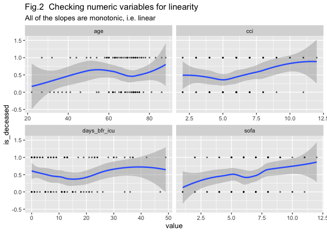
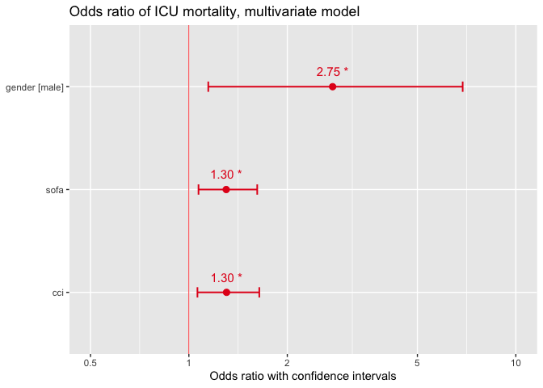

Mortality predictors in hematological patients, admitted to intensive
care unit: a single-centre observational study
================
Sergei Vladimirov
2023-12-26

# Abstract

Purpose: Previous research showed conflicting results about mortality
predictors in critically ill patients with hematological malignancies
(HM). The primary aim of this study was to determine mortality in
critically ill patients with HM in intensive care unit (ICU) and to
reveal risk factors predicting the outcome.

Methods and materials: All patients with HM admitted to ICU at our
hospital during 1 year were enrolled. Clinical data upon ICU admission
was collected and then outcomes were estimated.

Results: ICU mortality was 52% among 98 HM patients. According to
multivariate analysis, male sex (OR 2.75, CI: 1.15–6.88, p = 0.026),
high SOFA score (OR 1.30, CI: 1.07–1.62, p = 0.012) and high Charlson
Comorbidity Index (OR 1.30, CI: 1.06–1.64, p = 0.016) were associated
with the outcome.

Conclusion: We found three independent predictors for ICU mortality.
Further research is needed to validate current findings and reveal new
mortality predictors in critically ill HM patients.

# Introduction

Patients with hematologic malignancies (HMs) have an increased risk of
death compared to other oncology patients in settings of intensive care
unit (ICU). According to previous research1, the predictive value of
different admission factors is constantly changing, and several studies
on this topic have conflicting results. Our research question is
addressed to identifying factors in the condition of hematological
patients that can predict a poor ICU outcome. The primary aim of this
study was to determine ICU mortality and risk factors predicting the
outcome of critically ill patients with HMs. We hypothesized that there
are some significant factors in the condition of HM patients at the
moment of ICU admission that are associated with mortality.

# Methods

Our research is an observational, single-center study. We
retrospectively evaluated baseline characteristics of adult HM patients
non-electively admitted to the medical ICU of our hospital from July 1,
2022 to June 30,2023. All the HM diagnoses were based on the
pathological examination results or medical records. All data were
obtained from a local ICU electronic database. Cases with a critical
amount of missing data, as well as those who died or transferred to the
floor within 24 hours were excluded from the study.

 Upon ICU admission, we
included baseline patients’ information on demographic data, diagnosis,
extent of organ dysfunction, comorbidity burden, presence of
neutropenia, disease status and number of days in hospital prior to ICU
referral. Based on above-mentioned information, independent variables
were created, and the outcome of ICU hospitalization was set as a
dependent variable (Table 1).

<table>
<thead>
<tr>
<th style="text-align:left;">
variable
</th>
<th style="text-align:left;">
definition
</th>
<th style="text-align:left;">
type
</th>
<th style="text-align:left;">
status
</th>
</tr>
</thead>
<tbody>
<tr>
<td style="text-align:left;">
id
</td>
<td style="text-align:left;">
anonymized identical number of patient
</td>
<td style="text-align:left;">
numerical
</td>
<td style="text-align:left;">
independent
</td>
</tr>
<tr>
<td style="text-align:left;">
gender
</td>
<td style="text-align:left;">
gender of patient
</td>
<td style="text-align:left;">
categorical, binary
</td>
<td style="text-align:left;">
independent
</td>
</tr>
<tr>
<td style="text-align:left;">
age
</td>
<td style="text-align:left;">
age of patient
</td>
<td style="text-align:left;">
numerical, years
</td>
<td style="text-align:left;">
independent
</td>
</tr>
<tr>
<td style="text-align:left;">
cci
</td>
<td style="text-align:left;">
Charlson Comorbidity Index - most widely used scoring system for
comorbidities
</td>
<td style="text-align:left;">
numerical, points
</td>
<td style="text-align:left;">
independent
</td>
</tr>
<tr>
<td style="text-align:left;">
diagnosis
</td>
<td style="text-align:left;">
type of hematological malignancy
</td>
<td style="text-align:left;">
categorical
</td>
<td style="text-align:left;">
independent
</td>
</tr>
<tr>
<td style="text-align:left;">
disease_status
</td>
<td style="text-align:left;">
status of HM progression
</td>
<td style="text-align:left;">
categorical: p (progression) - relapsed or refractory disease, n - newly
diagnosed
</td>
<td style="text-align:left;">
independent
</td>
</tr>
<tr>
<td style="text-align:left;">
days_bfr_icu
</td>
<td style="text-align:left;">
number of days in hospital before admission to ICU
</td>
<td style="text-align:left;">
numerical, days
</td>
<td style="text-align:left;">
independent
</td>
</tr>
<tr>
<td style="text-align:left;">
sofa
</td>
<td style="text-align:left;">
sequential organ failure assessment score (SOFA score), is used to
determine the extent of organ function or rate of failure
</td>
<td style="text-align:left;">
numerical, points
</td>
<td style="text-align:left;">
independent
</td>
</tr>
<tr>
<td style="text-align:left;">
neutropenia
</td>
<td style="text-align:left;">
absolute neutrophil count \< 1000 per mm3
</td>
<td style="text-align:left;">
categorical, binary (1 = yes, 0 = no)
</td>
<td style="text-align:left;">
independent
</td>
</tr>
<tr>
<td style="text-align:left;">
is_deceased
</td>
<td style="text-align:left;">
outcome (1 is death, 0 is survival)
</td>
<td style="text-align:left;">
categorical, binary (1 is death, 0 is survival)
</td>
<td style="text-align:left;">
dependent
</td>
</tr>
</tbody>
</table>

This study was carried out according to the principles of the
Declaration of Helsinki. Approval was granted by the local ethics
committee (date: 03.08.2023 / no: 1236). Since we performed a
retrospective analysis of routinely collected de-identified data,
informed consents from the patients were not required. The trial was
registered. All statistical analyses were performed using R version
4.2.1 (R Core Team, 2022). Сontinuous variables were described as mean
(standard deviation), median (25–75 percentiles) and range. We performed
a univariate analysis first to calculate the odds ratio (OR) of
mortality, and statistically significant factors were then used in a
multivariate logistic regression model to determine outcome prediction.
Receiver operating curve (ROC) was done for the final model. In this
research, all the tests were two-sided, and p \< 0.05 was considered as
statistically significant.

# Results

The baseline demographic and clinical characteristics of all 98 patients
are given in Table 2. The patients’ mean (SD) age was 64 (14) years, and
just over half (55%) were females. Acute leukemia was the most frequent
diagnosis (43%), followed by multiple myeloma (26%), then non-Hodgkin’s
lymphoma (18%). 48 (49%) of patients had refractory or relapsed disease
status. 35 (36%) patients had neutropenia on admission. Median (IQR)
time in the ward before admission to ICU was 11 (3, 20) days. Mean (SD)
SOFA score on ICU referral was 6.38 (2.37) points, and Charlson
Comorbidity Index was 6.1 (2.25) points.

The ICU mortality was 52%. We performed univariate analysis (Table 3) to
calculate the odds ratio of mortality for each of collected covariates
(Table 3). All continuous variables were checked for linearity
beforehand (Figure 2).

<!-- -->
Three statistically significant factors were identified in univariate
model.

<table style="border-collapse:collapse; border:none;">
<caption style="font-weight: bold; text-align:left;">
Results of univariate analysis of factors
</caption>
<tr>
<th style="border-top: double; text-align:center; font-style:normal; font-weight:bold; padding:0.2cm;  text-align:left; ">
 
</th>
<th colspan="3" style="border-top: double; text-align:center; font-style:normal; font-weight:bold; padding:0.2cm; ">
is deceased
</th>
</tr>
<tr>
<td style=" text-align:center; border-bottom:1px solid; font-style:italic; font-weight:normal;  text-align:left; ">
Predictors
</td>
<td style=" text-align:center; border-bottom:1px solid; font-style:italic; font-weight:normal;  ">
Odds Ratios
</td>
<td style=" text-align:center; border-bottom:1px solid; font-style:italic; font-weight:normal;  ">
CI
</td>
<td style=" text-align:center; border-bottom:1px solid; font-style:italic; font-weight:normal;  ">
p
</td>
</tr>
<tr>
<td style=" padding:0.2cm; text-align:left; vertical-align:top; text-align:left; ">
gender \[male\]
</td>
<td style=" padding:0.2cm; text-align:left; vertical-align:top; text-align:center;  ">
2.73
</td>
<td style=" padding:0.2cm; text-align:left; vertical-align:top; text-align:center;  ">
1.12 – 6.95
</td>
<td style=" padding:0.2cm; text-align:left; vertical-align:top; text-align:center;  ">
<strong>0.030</strong>
</td>
</tr>
<tr>
<td style=" padding:0.2cm; text-align:left; vertical-align:top; text-align:left; ">
age
</td>
<td style=" padding:0.2cm; text-align:left; vertical-align:top; text-align:center;  ">
0.99
</td>
<td style=" padding:0.2cm; text-align:left; vertical-align:top; text-align:center;  ">
0.95 – 1.03
</td>
<td style=" padding:0.2cm; text-align:left; vertical-align:top; text-align:center;  ">
0.508
</td>
</tr>
<tr>
<td style=" padding:0.2cm; text-align:left; vertical-align:top; text-align:left; ">
sofa
</td>
<td style=" padding:0.2cm; text-align:left; vertical-align:top; text-align:center;  ">
1.31
</td>
<td style=" padding:0.2cm; text-align:left; vertical-align:top; text-align:center;  ">
1.07 – 1.63
</td>
<td style=" padding:0.2cm; text-align:left; vertical-align:top; text-align:center;  ">
<strong>0.012</strong>
</td>
</tr>
<tr>
<td style=" padding:0.2cm; text-align:left; vertical-align:top; text-align:left; ">
cci
</td>
<td style=" padding:0.2cm; text-align:left; vertical-align:top; text-align:center;  ">
1.40
</td>
<td style=" padding:0.2cm; text-align:left; vertical-align:top; text-align:center;  ">
1.07 – 1.90
</td>
<td style=" padding:0.2cm; text-align:left; vertical-align:top; text-align:center;  ">
<strong>0.020</strong>
</td>
</tr>
<tr>
<td style=" padding:0.2cm; text-align:left; vertical-align:top; text-align:left; ">
disease status \[p\]
</td>
<td style=" padding:0.2cm; text-align:left; vertical-align:top; text-align:center;  ">
1.27
</td>
<td style=" padding:0.2cm; text-align:left; vertical-align:top; text-align:center;  ">
0.50 – 3.35
</td>
<td style=" padding:0.2cm; text-align:left; vertical-align:top; text-align:center;  ">
0.617
</td>
</tr>
<tr>
<td style=" padding:0.2cm; text-align:left; vertical-align:top; text-align:left; ">
days bfr icu
</td>
<td style=" padding:0.2cm; text-align:left; vertical-align:top; text-align:center;  ">
1.00
</td>
<td style=" padding:0.2cm; text-align:left; vertical-align:top; text-align:center;  ">
0.96 – 1.04
</td>
<td style=" padding:0.2cm; text-align:left; vertical-align:top; text-align:center;  ">
0.935
</td>
</tr>
<tr>
<td style=" padding:0.2cm; text-align:left; vertical-align:top; text-align:left; padding-top:0.1cm; padding-bottom:0.1cm; border-top:1px solid;">
Observations
</td>
<td style=" padding:0.2cm; text-align:left; vertical-align:top; padding-top:0.1cm; padding-bottom:0.1cm; text-align:left; border-top:1px solid;" colspan="3">
98
</td>
</tr>
<tr>
<td style=" padding:0.2cm; text-align:left; vertical-align:top; text-align:left; padding-top:0.1cm; padding-bottom:0.1cm;">
AIC
</td>
<td style=" padding:0.2cm; text-align:left; vertical-align:top; padding-top:0.1cm; padding-bottom:0.1cm; text-align:left;" colspan="3">
130.026
</td>
</tr>
</table>

Statistically significant variables were checked for multicollinearity
(Table 4) and then included into a multivariate regression analysis
(Table 5).

<table>
<thead>
<tr>
<th style="text-align:left;">
</th>
<th style="text-align:left;">
variable
</th>
<th style="text-align:right;">
GVIF
</th>
</tr>
</thead>
<tbody>
<tr>
<td style="text-align:left;">
gender
</td>
<td style="text-align:left;">
gender
</td>
<td style="text-align:right;">
1.007099
</td>
</tr>
<tr>
<td style="text-align:left;">
cci
</td>
<td style="text-align:left;">
cci
</td>
<td style="text-align:right;">
1.035426
</td>
</tr>
<tr>
<td style="text-align:left;">
sofa
</td>
<td style="text-align:left;">
sofa
</td>
<td style="text-align:right;">
1.034088
</td>
</tr>
</tbody>
</table>

All of included factors - male sex (OR 2.75, CI: 1.15–6.88, p = 0.026),
high SOFA score (OR 1.30, CI: 1.07–1.62, p = 0.012) and high Charlson
Comorbidity Index (OR 1.30, CI: 1.06–1.64, p = 0.016) were associated
with outcome. Overall performance of multivariate model characterized by
Akaike information criterion (AIC)124.71 and area under the curve (AUC)
0.74 (Figure 3).

<table style="border-collapse:collapse; border:none;">
<caption style="font-weight: bold; text-align:left;">
Results of multivariate analysis of factors
</caption>
<tr>
<th style="border-top: double; text-align:center; font-style:normal; font-weight:bold; padding:0.2cm;  text-align:left; ">
 
</th>
<th colspan="3" style="border-top: double; text-align:center; font-style:normal; font-weight:bold; padding:0.2cm; ">
is deceased
</th>
</tr>
<tr>
<td style=" text-align:center; border-bottom:1px solid; font-style:italic; font-weight:normal;  text-align:left; ">
Predictors
</td>
<td style=" text-align:center; border-bottom:1px solid; font-style:italic; font-weight:normal;  ">
Odds Ratios
</td>
<td style=" text-align:center; border-bottom:1px solid; font-style:italic; font-weight:normal;  ">
CI
</td>
<td style=" text-align:center; border-bottom:1px solid; font-style:italic; font-weight:normal;  ">
p
</td>
</tr>
<tr>
<td style=" padding:0.2cm; text-align:left; vertical-align:top; text-align:left; ">
gender \[male\]
</td>
<td style=" padding:0.2cm; text-align:left; vertical-align:top; text-align:center;  ">
2.75
</td>
<td style=" padding:0.2cm; text-align:left; vertical-align:top; text-align:center;  ">
1.15 – 6.88
</td>
<td style=" padding:0.2cm; text-align:left; vertical-align:top; text-align:center;  ">
<strong>0.026</strong>
</td>
</tr>
<tr>
<td style=" padding:0.2cm; text-align:left; vertical-align:top; text-align:left; ">
sofa
</td>
<td style=" padding:0.2cm; text-align:left; vertical-align:top; text-align:center;  ">
1.30
</td>
<td style=" padding:0.2cm; text-align:left; vertical-align:top; text-align:center;  ">
1.07 – 1.62
</td>
<td style=" padding:0.2cm; text-align:left; vertical-align:top; text-align:center;  ">
<strong>0.012</strong>
</td>
</tr>
<tr>
<td style=" padding:0.2cm; text-align:left; vertical-align:top; text-align:left; ">
cci
</td>
<td style=" padding:0.2cm; text-align:left; vertical-align:top; text-align:center;  ">
1.30
</td>
<td style=" padding:0.2cm; text-align:left; vertical-align:top; text-align:center;  ">
1.06 – 1.64
</td>
<td style=" padding:0.2cm; text-align:left; vertical-align:top; text-align:center;  ">
<strong>0.016</strong>
</td>
</tr>
<tr>
<td style=" padding:0.2cm; text-align:left; vertical-align:top; text-align:left; padding-top:0.1cm; padding-bottom:0.1cm; border-top:1px solid;">
Observations
</td>
<td style=" padding:0.2cm; text-align:left; vertical-align:top; padding-top:0.1cm; padding-bottom:0.1cm; text-align:left; border-top:1px solid;" colspan="3">
98
</td>
</tr>
<tr>
<td style=" padding:0.2cm; text-align:left; vertical-align:top; text-align:left; padding-top:0.1cm; padding-bottom:0.1cm;">
AIC
</td>
<td style=" padding:0.2cm; text-align:left; vertical-align:top; padding-top:0.1cm; padding-bottom:0.1cm; text-align:left;" colspan="3">
124.710
</td>
</tr>
</table>

<!-- -->
